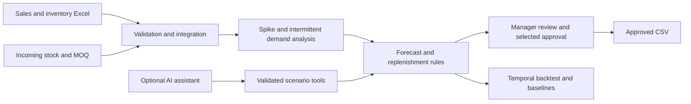

# LogiPilot — заказы поставщикам

**LowSkillDevs · HackAlem AI · кейс Электрокомплект (ekt.kz)**

**Hackathon team repository:** `hack-e7389344-lowskilldevs` · **Track/Topic:** Logistics.

Менеджер закупок загружает отчёты ИЭК и Systeme Electric, получает предложения по пополнению склада с объяснением по каждому артикулу, корректирует количества и утверждает выгрузку. Приложение учитывает сезонность, динамику продаж, остатки, товары в пути, минимальную партию и кратность. Разовые всплески обрабатываются отдельно от регулярного спроса.

Рабочий MVP на Python и Streamlit: воспроизводимый расчёт, проверка на истории, согласование выбранных позиций и AI-помощник с инструментами сценарного анализа. Основные функции работают без API-ключа. OpenAI подключается отдельно; модели передаются вопрос, названия поставщиков и агрегированные результаты инструментов, без построчных продаж и исходных Excel.

**[Открыть интерактивное демо для жюри](https://zhurf14u-sketch.github.io/logipilot-hackalem-demo/)** — 9 вымышленных товаров, сценарии, объяснения и CSV. Это публичный резерв демонстрации на заранее рассчитанных результатах; полная версия с импортом и AI запускается ниже.

**Для защиты:** [сценарий на 3 минуты](docs/PITCH.md), [результаты проверки на реальных данных](docs/VALIDATION.md), [автономная интерактивная демонстрация](docs/demo.html). Скачайте `docs/demo.html` и откройте в браузере — установка и интернет не нужны. В ней только синтетические данные и 24 заранее рассчитанных сценария того же Python-модуля.

## Быстрый запуск

Нужен Python 3.11–3.13; рекомендуем 3.12.

```powershell
git clone https://github.com/BAITC-Hacks/hack-e7389344-lowskilldevs.git
cd hack-e7389344-lowskilldevs
python -m venv .venv
.\.venv\Scripts\python.exe -m pip install -r requirements.txt
.\.venv\Scripts\python.exe -m streamlit run app.py
```

В Windows также можно дважды нажать `run.bat`. Он создаёт локальное окружение, устанавливает зависимости и запускает приложение.

В Linux/macOS после создания окружения:

```bash
.venv/bin/python -m pip install -r requirements.txt
.venv/bin/python -m streamlit run app.py
```

Адрес приложения: [localhost:8501](http://localhost:8501). Первым открывается демонстрация: 9 синтетических товаров двух поставщиков, сезонность, рост, разовый крупный заказ, дефицит, редкий регулярный спрос и избыточный запас. Дата примера — 22.09.2026.

## Работа со своими Excel

1. В боковой панели откройте «Загрузить Excel поставщика».
2. Выберите поставщика и загрузите его шесть файлов: ежемесячные продажи, ежемесячные остатки, динамику продаж, MOQ, сезонность и товар в пути.
3. Нажмите «Импортировать отчёты». При необходимости добавьте второго поставщика отдельно.
4. Проверьте дату расчёта, срок поставки, период между заказами и страховой запас. Параметры применяются ко всем выбранным позициям; разные условия поставщиков можно рассчитать отдельно фильтром.
5. На вкладке «Данные» прочитайте предупреждения. При наличии подтверждённых сведений внесите актуальный остаток или дату поступления с основанием исправления. На вкладке спроса разберите отдельный артикул и сравните расчёт с обработкой всплесков и без неё.
6. В таблице заказов выберите готовые позиции. Спорные позиции можно оставить на проверке или явно отложить; они не блокируют выгрузку остальных. Для включения спорной строки укажите положительное целое количество и основание решения.
7. Подтвердите выбранные позиции и скачайте CSV. Любое изменение данных, параметров или решений отменяет подтверждение. В CSV сохраняются предложенное и принятое количества и основание ручного решения.

**Никакой автоматической отправки поставщику нет.** Итоговый CSV использует UTF-8 с BOM и разделитель `;`; его можно открыть в Excel. Стандартная панель таблицы также позволяет скачать черновые данные, которые не являются утверждённым заказом. Совместимость с конкретной конфигурацией импорта 1С требует согласования.

## Какие источники используются

| Источник | Участие в расчёте |
| --- | --- |
| Ежемесячные продажи | Основной ряд спроса по коду номенклатуры; незавершённый месяц не обучает прогноз |
| Ежемесячные остатки | Последний доступный снимок и признаки возможного отсутствия товара в истории |
| Динамика продаж | Дневные продажи и возвраты, обнаружение всплесков, рост по сопоставимым полным периодам; продажи не прибавляются повторно к месячному отчёту |
| Сезонность | Коэффициенты месяцев поставщика с применением к категориям |
| MOQ | Минимальная партия и кратность заказа; сопоставление кодов через справочные поля |
| Товар в пути | Поступления в пределах горизонта; в отчёте Systeme Electric также есть категории и свободный остаток |

Импорт настроен на предоставленные выгрузки ИЭК и Systeme Electric, включая служебные строки и широкие таблицы с русскими месяцами. Другой формат отчёта может потребовать адаптера. Ключ позиции — пара «поставщик + код номенклатуры»; ведущие нули сохраняются. Если категории нет, используется явная группа «Все».

Файлы компании не входят в репозиторий и не требуются для демо. При локальном запуске импорт остаётся на компьютере пользователя. Если приложение запущено на удалённом сервере, загруженные файлы обрабатывает этот сервер.

## Методология

### Очистка регулярного спроса

Возвраты сохраняются со знаком; отрицательный итог месяца не превращается в положительный спрос. Месячный ряд очищается от сезонности, затем сравнивается с устойчивыми оценками уровня спроса. Аномальные пики заменяются регулярной оценкой; исходные значения остаются доступны на графике. Дневной журнал позволяет дополнительно обнаружить единичные крупные продажи без повторного суммирования с месячной историей.

Для регулярного спроса за последние 24 полных месяца используются медиана `m` и масштаб `s = 1.4826 × median(|x − m|)`. При наличии хотя бы четырёх наблюдений высокий выброс — значение выше `max(m + 3.5s, 2.5m, m + 3)`. Он заменяется медианой неаномальных значений с возвратом сезонного коэффициента. Дневная проверка требует минимум восьми дней продаж и дополнительно превышения пятикратной медианы и 10 единиц. Вычитается только избыточная часть соответствующего месяца.

**Редкий спрос обрабатывается отдельно.** Если положительные продажи встречаются не более чем в 60% наблюдаемых месяцев, сравниваются размеры положительных событий, а нулевые месяцы сохраняются. Для выявления крупного события нужны минимум три положительных месяца; порог — `max(m + 3.5s, 4m, m + 3)`. Прогноз строится по средней частоте последних 12 наблюдаемых месяцев. Ряд `[0, 0, 10] × 4` сохраняет средний спрос 3,33 единицы в месяц. Единственное положительное событие не обнуляется: оно требует классификации менеджером. Отсутствующие месяцы не подменяются нулями.

При наличии обезличенного `customer_id` в нормализованных транзакциях алгоритм может отдельно проверить концентрацию объёма у клиента. **В предоставленных Excel такого поля нет**, поэтому здесь нельзя утверждать, что всплеск вызван конкретным клиентом. Подозрение на разовую продажу является эвристикой и требует проверки менеджером.

### Недопродажи, сезонность и рост

Нулевой месячный остаток и низкие продажи используются как признак возможного отсутствия товара. Оценка регулярного спроса восстанавливает часть недопродаж с ограничением величины поправки. Это приближение: месячные снимки не позволяют определить точные дни stockout.

На очищенном ряде регулярного спроса оценивается устойчивый тренд. Он учитывается вместе с ростом из источника динамики и ручной поправкой менеджера. Сезонные коэффициенты применяются по календарным дням прогнозного горизонта. Для прерывистого спроса индивидуальный тренд не экстраполируется из редких событий. Прогнозирование статистическое; LLM используется для выбора инструментов и объяснения сценариев.

Наклон тренда — медиана попарных месячных наклонов за последние 12 месяцев; базовый уровень оценивается по последним шести. Годовой тренд SKU ограничен диапазоном −50…+50%. При наличии роста категории он смешивается с трендом SKU в пропорции 40/60; затем добавляется ручная годовая поправка. Итоговый годовой рост ограничен −80…+100%. Компенсация недопродаж за отдельный месяц ограничена 50% типичного сезонного спроса.

### Количество к заказу

```text
Горизонт = срок поставки + период между заказами + страховой запас в днях
Потребность = сумма прогнозного спроса на дни горизонта
Чистая потребность = max(0, потребность − остаток − учитываемый товар в пути)
Заказ при положительной потребности = округлить вверх(max(чистая потребность, MOQ) / кратность) × кратность
```

Датированные поступления после горизонта не уменьшают заказ. Неизвестные даты прихода, начальный или неподтверждённый месячный остаток и устаревший снимок требуют ручной проверки. Дополнительно проверяется разрыв запаса до позднего поступления: общая сумма товара в пути не должна скрывать дефицит до его прихода. Приоритет отражает риск дефицита за срок поставки. В каждой строке сохраняется объяснение входных чисел и поправок.

## Архитектура



## Ограничения данных и прототипа

- В ИЭК ежемесячные остатки обозначены как **начальные остатки**. Их нельзя считать фактическим свободным остатком на 22 сентября. Перед утверждением заказа нужны актуальные складские данные.
- Заголовок Systeme Electric «СЭ в пути 24.09» сам по себе не подтверждает дату прибытия. Такие поступления отмечаются как требующие уточнения.
- В исходных данных нет полного справочника сроков поставки, точных дней отсутствия и обезличенных клиентов. Интерфейс делает соответствующие допущения явными.
- Категории, месячные агрегаты и дневной журнал могут различаться по охвату складов и периодов. Прототип агрегирует поставщика; отдельный фильтр по складу пока не реализован.
- Денежная экономия, повышение точности и снижение дефицита не заявляются как измеренные результаты. Рекомендация требует проверки закупщиком.

## Проверка на истории

Вкладка «Проверка на истории» сравнивает три метода на одних и тех же SKU и месяцах: модель LogiPilot, среднее предыдущих трёх месяцев и тот же месяц прошлого года. Для каждого месячного окна история обрезается до его начала; сезонность и рост пересчитываются из доступного прошлого. Недатированные коэффициенты исходных файлов и текущие складские снимки не используются при обучении в прошлом.

Выборка фиксируется до первого контрольного месяца, стратифицируется по поставщику и регулярности спроса; отбор внутри групп детерминирован. Интерфейс показывает MAE, WAPE, смещение, охват, исключения и наличие сведений об остатках. Неизвестный остаток не означает наличие товара.

На 120 SKU и 360 наблюдениях за июнь–август 2026 года WAPE составил **34,88% у LogiPilot, 25,59% у среднего за 3 месяца и 47,41% у прошлогоднего месяца**. Простое среднее лучше на этой выборке наблюдаемых продаж. Это диагностическая проверка, без подстройки под контрольный период; подтверждённого преимущества по точности или экономии пока нет. Методология и ограничения: [docs/VALIDATION.md](docs/VALIDATION.md).

## AI-помощник

Во вкладке «AI-помощник» доступны сценарии задержки поставки, изменения годовой поправки спроса и проверки данных. Без API они выполняются локально по распознаваемым формулировкам. Для настоящего tool calling включите OpenAI API и введите ключ и название доступной вашей команде модели. Ключ остаётся в памяти сессии приложения; кнопка «Забыть ключ» удаляет его из неё. Не помещайте ключ в Git.

Через [OpenAI Responses API](https://developers.openai.com/api/docs/guides/function-calling) модель выбирает инструмент, сервер проверяет аргументы, Python рассчитывает сценарий, а модель объясняет результат. Журнал вызовов и сравнение показываются пользователю. Запросы используют `store: false`; применяются условия обработки данных поставщика API. Вопрос отправляется модели целиком: не включайте в него секреты и данные клиентов. При ошибке API переход на локальный сценарий явно обозначается. Инструменты не утверждают и не отправляют заказы.

Пример: «Поставка ИЭК задержится на 10 дней. Сравни риски». Сценарий увеличивает срок новых поставок и переносит известные даты товара в пути выбранного поставщика на 10 дней. Исходные данные и текущий утверждённый заказ не изменяются. Сценарий роста добавляет процентные пункты к годовой поправке, а не умножает весь заказ на указанный процент.

## Тесты и структура

```bash
python -m unittest discover -s tests -v
```

Тесты проверяют расчёт, редкий спрос, влияние источников, всплески, недопродажи, округление, временную изоляцию проверки, ручные решения и протокол вызова AI-инструментов. API проверяется с имитацией ответов; перед защитой нужен отдельный живой запрос с ключом команды. Автоматическая проверка GitHub Actions не настроена.

```text
app.py             Интерфейс, редактирование, утверждение и CSV
planner.py         Прогноз и расчёт заказа
data_loader.py     Адаптеры исходных Excel и проверка данных
demo_data.py       Воспроизводимые синтетические сценарии
ai_agent.py        Инструменты сценариев, локальный режим и OpenAI tool calling
evaluation.py      Проверка на истории без будущих данных
order_workflow.py  Выбор, ручные решения, подтверждение и безопасный CSV
docs/              Сценарий защиты, измерения, автономная демонстрация
scripts/           Воспроизводимая сборка автономной демонстрации
tests/             Автоматические проверки
ACCEPTANCE.md      Соответствие ТЗ и границы реализации
```

## Демонстрация за три минуты

1. Откройте приложение: сразу видны предложения по двум поставщикам.
2. Выберите DEMO-002: покажите крупную продажу июня и очищенную историю.
3. Выберите DEMO-005: редкие покупки сохраняют регулярную потребность.
4. Запустите сценарий задержки поставки в AI-помощнике и покажите вызов инструмента.
5. Покажите честное сравнение с базовыми методами на вкладке проверки истории.
6. Выберите проверенные позиции, подтвердите заказ и скачайте CSV. Подробный тайминг и ответы жюри: [docs/PITCH.md](docs/PITCH.md).

Команда: **LowSkillDevs**. 

Владелец кейса: **Электрокомплект**. 

Подробная проверка требований: [ACCEPTANCE.md](ACCEPTANCE.md).
