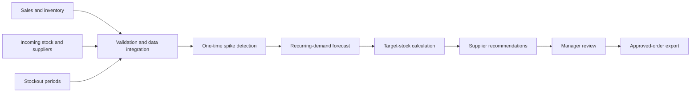

# hack-e7389344-lowskilldevs
## Hackathon team repository for LowSkillDevs

**Track/Topic:** Logistics

The project is being developed for the Elektrocomplekt LLC (ekt.kz) case at HackAlem AI

## Problem

Warehouse replenishment is currently calculated manually by consolidating data in Excel. Because detailed analysis is time-consuming, purchase orders are generated infrequently rather than in near real time. This creates two major problems:

- excess inventory and unnecessary storage costs;
- stock shortages and lost sales.

One-time bulk purchases, including unusually large purchases by a single customer, can also inflate estimates of recurring demand.

## Solution

The service analyzes each SKU (storage keeping unit) and generates a recommended supplier order with an explanation of the result. A procurement manager reviews and may adjust the recommendations before approving an order.

The primary workflow is:

1. The manager uploads data or starts a calculation for a warehouse or product category.
2. The service validates the data and identifies anomalous one-time sales.
3. The forecasting component estimates recurring demand using seasonality, trends, and stockout information.
4. The service calculates the required quantity using current inventory and incoming stock.
5. Recommendations are grouped by supplier and made available for review and export.
6. An authorized employee reviews and approves the order.

Functional static MVP built with Python and Streamlit. No API keys are required to run it. Source data is not transmitted to AI services.

## Quick Start

Python 3.11–3.13 are required; Python 3.12 are recommended.

```powershell
git clone https://github.com/BAITC-Hacks/hack-e7389344-lowskilldevs.git
cd hack-e7389344-lowskilldevs
python -m venv .venv
.\.venv\Scripts\python.exe -m pip install -r requirements.txt
.\.venv\Scripts\python.exe -m streamlit run app.py
```

В Windows также можно дважды нажать `run.bat`. Он создаёт локальное окружение, устанавливает зависимости и запускает приложение.

В Linux/macOS после создания окружения:

```bash
.venv/bin/python -m pip install -r requirements.txt
.venv/bin/python -m streamlit run app.py
```

Адрес приложения: [localhost:8501](http://localhost:8501). Первым открывается демонстрация: 8 синтетических товаров двух поставщиков, сезонность, рост, разовый крупный заказ, дефицит и избыточный запас. Дата примера — 22.09.2026.

## Работа со своими Excel

1. В боковой панели откройте «Загрузить Excel поставщика».
2. Выберите поставщика и загрузите его шесть файлов: ежемесячные продажи, ежемесячные остатки, динамику продаж, MOQ, сезонность и товар в пути.
3. Нажмите «Импортировать отчёты». При необходимости добавьте второго поставщика отдельно.
4. Проверьте дату расчёта, срок поставки, период между заказами и страховой запас. Параметры применяются ко всем выбранным позициям; разные условия поставщиков можно рассчитать отдельно фильтром.
5. На вкладке качества данных прочитайте предупреждения. На вкладке спроса разберите отдельный артикул и посмотрите фактическую и скорректированную историю.
6. В таблице заказов отредактируйте количество. Позиции без надёжных данных требуют ручного решения, включая явный ноль при отказе от заказа.
7. Подтвердите итоговый заказ и скачайте CSV. Любое изменение данных, параметров или количеств требует нового подтверждения.

**Никакой автоматической отправки поставщику нет.** Итоговый CSV использует UTF-8 с BOM и разделитель `;`; его можно открыть в Excel. Стандартная панель таблицы также позволяет скачать черновые данные, которые не являются утверждённым заказом. Совместимость с конкретной конфигурацией импорта 1С требует согласования.

## Какие источники используются

| Источник | Участие в расчёте |
| --- | --- |
| Ежемесячные продажи | Основной ряд спроса по коду номенклатуры; незавершённый месяц не обучает прогноз |
| Ежемесячные остатки | Последний доступный снимок и признаки возможного отсутствия товара в истории |
| Динамика продаж | Дневные продажи и возвраты, обнаружение всплесков, рост по сопоставимым полным периодам; продажи не прибавляются повторно к месячному отчёту |
| Сезонность | Коэффициенты месяцев поставщика с применением к категориям |
| MOQ | Минимальная партия и кратность заказа; сопоставление кодов через справочные поля |
| Товар в пути | Поступления в пределах горизонта; в отчёте Systeme Electric также есть категории и свободный остаток |

Импорт настроен на предоставленные выгрузки ИЭК и Systeme Electric, включая служебные строки и широкие таблицы с русскими месяцами. Другой формат отчёта может потребовать адаптера. Ключ позиции — пара «поставщик + код номенклатуры»; ведущие нули сохраняются. Если категории нет, используется явная группа «Все».

Файлы компании не входят в репозиторий и не требуются для демо. При локальном запуске импорт остаётся на компьютере пользователя. Если приложение запущено на удалённом сервере, загруженные файлы обрабатывает этот сервер.

## Методология

### Очистка регулярного спроса

Возвраты сохраняются со знаком; отрицательный итог месяца не превращается в положительный спрос. Месячный ряд очищается от сезонности, затем сравнивается с устойчивыми оценками уровня спроса. Аномальные пики заменяются регулярной оценкой; исходные значения остаются доступны на графике. Дневной журнал позволяет дополнительно обнаружить единичные крупные продажи без повторного суммирования с месячной историей.

Для последних 24 полных месяцев используются медиана `m` и масштаб `s = 1.4826 × median(|x − m|)`. При наличии хотя бы четырёх наблюдений высокий выброс — значение выше `max(m + 3.5s, 2.5m, m + 3)`. Он заменяется медианой неаномальных значений с возвратом сезонного коэффициента. Дневная проверка требует минимум восьми дней продаж и дополнительно превышения пятикратной медианы и 10 единиц. Вычитается только избыточная часть соответствующего месяца.

При наличии обезличенного `customer_id` в нормализованных транзакциях алгоритм может отдельно проверить концентрацию объёма у клиента. **В предоставленных Excel такого поля нет**, поэтому здесь нельзя утверждать, что всплеск вызван конкретным клиентом. Подозрение на разовую продажу является эвристикой и требует проверки менеджером.

### Недопродажи, сезонность и рост

Нулевой месячный остаток и низкие продажи используются как признак возможного отсутствия товара. Оценка регулярного спроса восстанавливает часть недопродаж с ограничением величины поправки. Это приближение: месячные снимки не позволяют определить точные дни stockout.

На очищенном ряде оценивается устойчивый тренд. Он учитывается вместе с ростом из источника динамики и ручной поправкой менеджера. Сезонные коэффициенты применяются по календарным дням прогнозного горизонта; прогноз не равен среднему за всю историю. Отдельная обученная ML-модель и внешняя LLM в этой версии не используются. Проверка качества на отложенном временном периоде остаётся дальнейшей задачей.

Наклон тренда — медиана попарных месячных наклонов за последние 12 месяцев; базовый уровень оценивается по последним шести. Годовой тренд SKU ограничен диапазоном −50…+50%. При наличии роста категории он смешивается с трендом SKU в пропорции 40/60; затем добавляется ручная годовая поправка. Итоговый годовой рост ограничен −80…+100%. Компенсация недопродаж за отдельный месяц ограничена 50% типичного сезонного спроса.

### Количество к заказу

```text
Горизонт = срок поставки + период между заказами + страховой запас в днях
Потребность = сумма прогнозного спроса на дни горизонта
Чистая потребность = max(0, потребность − остаток − учитываемый товар в пути)
Заказ при положительной потребности = округлить вверх(max(чистая потребность, MOQ) / кратность) × кратность
```

Датированные поступления после горизонта не уменьшают заказ. Неизвестные даты прихода и недостоверный/устаревший остаток выделяются для ручной проверки. Приоритет отражает риск дефицита за срок поставки. В каждой строке сохраняется объяснение входных чисел и поправок.

## Ограничения данных и прототипа

- В ИЭК ежемесячные остатки обозначены как **начальные остатки**. Их нельзя считать фактическим свободным остатком на 22 сентября. Перед утверждением заказа нужны актуальные складские данные.
- Заголовок Systeme Electric «СЭ в пути 24.09» сам по себе не подтверждает дату прибытия. Такие поступления отмечаются как требующие уточнения.
- В исходных данных нет полного справочника сроков поставки, точных дней отсутствия и обезличенных клиентов. Интерфейс делает соответствующие допущения явными.
- Категории, месячные агрегаты и дневной журнал могут различаться по охвату складов и периодов. Прототип агрегирует поставщика; отдельный фильтр по складу пока не реализован.
- Денежная экономия, повышение точности и снижение дефицита не заявляются как измеренные результаты. Рекомендация требует проверки закупщиком.

## Тесты и структура

```bash
python -m unittest discover -s tests -v
```

Тесты проверяют расчёт, влияние источников, всплески, недопродажи, округление и ограничения данных. Запускайте их локально перед отправкой изменений. Автоматическая проверка GitHub Actions в этой версии не настроена.

```text
app.py             Интерфейс, редактирование, утверждение и CSV
planner.py         Прогноз и расчёт заказа
data_loader.py     Адаптеры исходных Excel и проверка данных
demo_data.py       Воспроизводимые синтетические сценарии
ai_agent.py        Локальное объяснение проверенного результата
tests/             Автоматические проверки
ACCEPTANCE.md      Соответствие ТЗ и границы реализации
```

Development team: **LowSkillDevs**
Challenge owner: **Электрокомплект**
Detailed verification of requirements: [ACCEPTANCE.md](ACCEPTANCE.md).


## Key Features

- replenishment calculations for each SKU;
- current inventory and incoming-stock adjustments;
- supplier lead-time and product-category support;
- seasonality and sustained demand-growth forecasting;
- lost-demand estimation for stockout periods;
- detection of one-time bulk orders and unusually large purchases by one customer;
- recommendations grouped by supplier;
- an explanation of every recommended quantity and urgency level;
- exportable order recommendations.

## Calculation Methodology

The service performs the following steps for each SKU.

### 1. Data preparation

- validate data types, dates, duplicates, and missing values;
- combine sales, inventory, incoming-stock, and supplier data;
- aggregate sales at the selected time interval;
- identify periods during which a product was unavailable.

### 2. One-time spike detection

One-time bulk sales are detected independently for each SKU. When an anonymized customer identifier is available, the service also checks whether an unusually large volume is concentrated under one customer.

A robust approach is recommended:

1. Estimate the typical sales volume using the median and median absolute deviation, or the interquartile range.
2. Flag observations that significantly exceed the expected range.
3. Determine whether the spike is isolated and associated with a single customer.
4. Exclude a confirmed anomaly from recurring-demand calculations or replace it with a robust estimate.
5. Preserve the original value and the reason for adjustment for auditability.

Seasonal peaks must not be classified automatically as outliers. The algorithm should compare each observation with equivalent seasonal periods and nearby values in the time series.

### 3. Stockout demand recovery

Zero or unusually low sales during a stockout do not necessarily indicate a lack of demand. Demand for these periods is estimated using adjacent periods, the seasonal profile, and, when appropriate, comparable products. The recovered value is used for forecasting and clearly marked as an estimate.

### 4. Recurring-demand forecast

The forecast is trained on the adjusted sales history and considers:

- baseline sales;
- seasonality;
- sustained trends;
- expected growth;
- estimated demand during stockout periods.

The forecasting model should be selected through time-based validation. For an MVP, seasonal averages, exponential smoothing, and a time-series model can be compared, with the best-performing approach selected using an agreed error metric.

### 5. Order calculation

The baseline calculation is:

```text
target stock = forecast demand over lead time and review period + safety stock

recommended order = max(
  0,
  target stock - current inventory - incoming stock
)
```

When supplier constraints are available, the result may also be adjusted for minimum order quantities and package-size multiples.

### 6. Result explanation

Every recommendation should describe the factors that affected the calculation. For example:

```text
SKU: ABC-123
Recommendation: 120 units
Reason: 30-day forecast — 150 units; current inventory — 40 units;
incoming stock — 20 units; safety stock — 30 units;
one-time sale of 200 units excluded.
Urgency: High
```

## Input Data

The minimum expected fields are:

| Dataset | Required fields |
| --- | --- |
| Sales history | date, SKU, quantity, price |
| Customers | anonymized customer ID |
| Products | SKU, product name, category |
| Inventory | date, warehouse, SKU, quantity |
| Incoming stock | SKU, quantity, expected arrival date |
| Suppliers | supplier, SKU, lead time |
| Stockouts | SKU, warehouse, stockout start and end dates |

Example sales file:

```csv
date,sku,name,quantity,price,anonymous_client_id,warehouse
2026-01-15,ABC-123,Power cable,8,1250.00,client_001,main
```

All customer information must be anonymized. Synthetic data with realistic distributions may be used for development and testing.

## Output

The service produces a table or dashboard with the following fields:

| Field | Description |
| --- | --- |
| SKU | Product identifier |
| Supplier | Recommended supplier |
| Quantity | Recommended order quantity |
| Explanation | Main factors behind the calculation |
| Urgency | Order priority |

## Architecture



## Getting Started

The case description does not define the technology stack. Keep the option that matches your implementation and remove the other one.

### Option A: Local development

```bash
git clone TODO_REPOSITORY_URL
cd TODO_REPOSITORY_DIRECTORY

# TODO: replace this example with the actual dependency setup
python -m venv .venv

# Windows
.venv\Scripts\activate

# macOS or Linux
source .venv/bin/activate

pip install -r requirements.txt

# TODO: replace this with the actual application command
python app.py
```

### Option B: Docker

```bash
git clone TODO_REPOSITORY_URL
cd TODO_REPOSITORY_DIRECTORY
docker compose up --build
```

After starting the service, open `TODO_LOCAL_URL`.

## Configuration

Create a `.env` file from `.env.example` and provide the required values:

```env
DATA_DIR=./data
OUTPUT_DIR=./outputs
FORECAST_HORIZON_DAYS=30
REVIEW_PERIOD_DAYS=7
SERVICE_LEVEL=0.95
```

Do not commit `.env`, real sales records, customer information, or exports from the accounting system. Add all sensitive and generated files to `.gitignore`.

## Usage Example

```bash
# TODO: replace this example with your application's actual interface
python app.py \
  --sales data/sales.csv \
  --inventory data/inventory.csv \
  --in-transit data/in_transit.csv \
  --suppliers data/suppliers.csv \
  --output outputs/recommendations.csv
```

## Acceptance Criteria

The minimum acceptance tests are:

- changing current inventory or incoming stock changes the final recommendation;
- a seasonal product receives a seasonal forecast rather than a simple historical average;
- estimated demand for a stockout period is greater than the result based only on recorded sales;
- adding an artificial one-time bulk sale does not significantly increase recurring demand;
- every recommendation includes an explanation and is assigned to a supplier;
- the system cannot send an order to a supplier without employee approval.

Useful evaluation metrics include:

- forecast WAPE or MAE on time-based validation data;
- stockout rate;
- product availability;
- inventory turnover and excess-inventory volume;
- percentage of recommendations adjusted by a procurement manager.

## Suggested Project Structure

Adapt this example to the actual repository:

```text
.
├── app/                  # API or user interface
├── src/
│   ├── data/             # data loading and validation
│   ├── preprocessing/    # cleaning and stockout processing
│   ├── forecasting/      # demand forecasting
│   ├── outliers/         # one-time order detection
│   └── ordering/         # recommendation calculation
├── tests/                # automated tests
├── data/                 # examples or synthetic data only
├── outputs/              # generated recommendations
├── .env.example
├── requirements.txt      # or the dependency file for your stack
└── README.md
```

## Constraints and Data Safety

- The service must not send an order to a supplier without approval from an authorized employee.
- Non-anonymized customer data must not be used.
- Outlier and stockout adjustments must remain explainable and reproducible.
- The output format must be compatible with the company's current accounting system.
- Recommendations support procurement decisions but do not replace manager review.

## Roadmap

- [ ] Connect sales-history and inventory exports.
- [ ] Implement baseline replenishment calculations by SKU.
- [ ] Add seasonality, trend, and stockout handling.
- [ ] Implement one-time bulk-order detection.
- [ ] Add explanations and supplier grouping.
- [ ] Implement recommendation export.
- [ ] Prioritize products by stockout risk.
- [ ] Support minimum order quantities and supplier-specific constraints.
- [ ] Add automated delivery of approved orders only after employee confirmation.

## Team

- Challenge owner: Elektrocomplekt LLC (ekt.kz)
- Development team: LowSkillDevs


